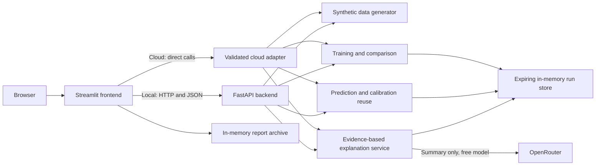

# Architecture and design decisions

## Separation of responsibilities

- FastAPI validates measurements, owns models, computes metrics, and keeps the
  OpenRouter key on the backend. Only explicit explanation requests call the LLM.
- In cloud mode, a validated adapter calls those services in the Streamlit server
  process, with session ownership checks, a training lock, and explanation throttling.
- Streamlit collects controls, retains displayed datasets/results in session
  state, renders charts, and prepares exports. UI components do not implement model fitting.
- The model store retains up to 16 runs for one hour. Unique run IDs avoid a
  shared latest-model slot. Expired or restarted runs require retraining.
- Reports contain measurements and evaluation artifacts, not fitted model
  binaries, secrets, environment files, or run access tokens.

## Evaluation design

At default settings, the 1,000 synthetic independent snapshots become 600
proper-training, 200 calibration, and 200 test rows. Model selection uses five
shared folds within proper training. Each estimator and its preprocessing are
freshly fitted in every fold. The lowest mean CV RMSE selects the model, which
is refitted on proper training. Calibration sets the 90% conformal half-width;
test rows evaluate performance and supply descriptive diagnostics.

Disabling Stage 5 restores an 80/20 train/test comparison. The Stage 3 workflow
preserves the original Linear Regression exercise.

## Deployment boundaries

This is one FastAPI worker and one Streamlit server, with synchronous training
and explanation requests. It has no authentication, durable model registry,
job queue, or live industrial sensor connection. Random run IDs are access
capabilities, not user authorization. The Community Cloud adapter additionally checks browser-session ownership and
bounds concurrent work. This remains a temporary portfolio demo, not an
authenticated production service. See [deployment details](deployment.md).

The LLM explains supplied evidence. It does not produce the numerical process
prediction. Free provider availability is external to this application; a
labeled local template keeps the demo useful during failures.
